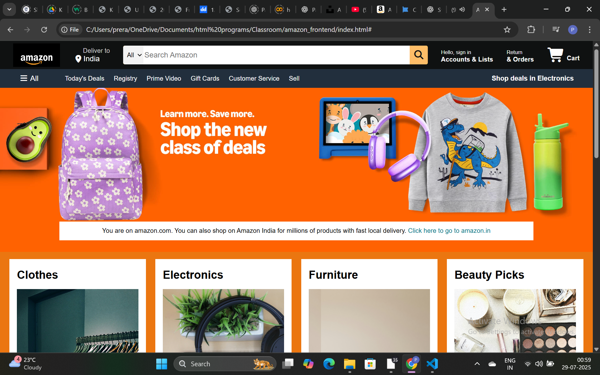
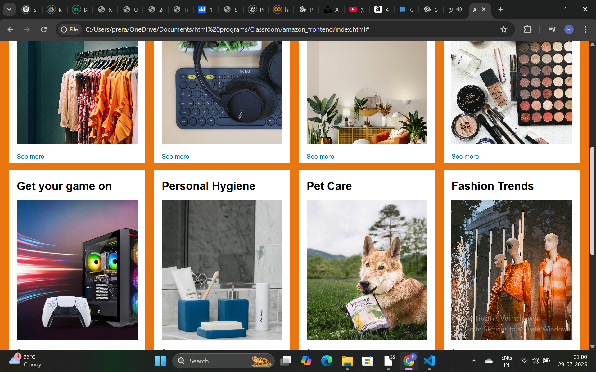
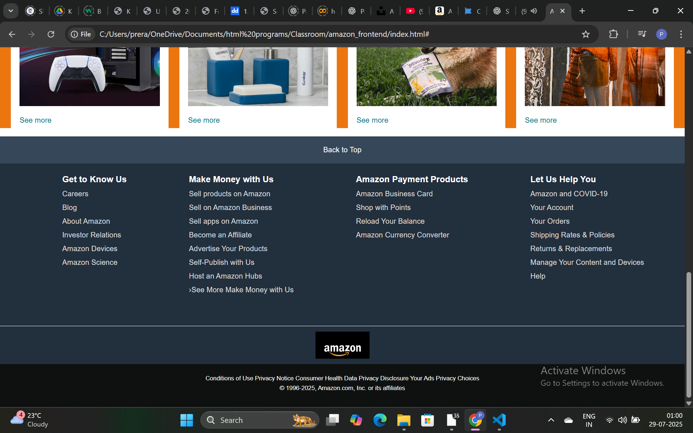

# Amazon-Frontend
A fully responsive Amazon-like frontend built using HTML and CSS. This project replicates the Amazon homepage UI layout, including navigation bar, search bar, hero section, product categories, and footer links — all built using pure HTML and CSS (no frameworks or JavaScript).

# 🛒 Amazon Frontend Clone (HTML + CSS)

A clone of the Amazon homepage built with pure HTML and CSS — no frameworks, no JavaScript.

## 🔍 Features

- Amazon-style navbar with logo, search, and user links
- Hero section with promotional banner and deals
- Product category tiles with clickable images
- Fully styled footer with structured columns
- Responsive design and clean layout

## 🚀 Tech Stack

- HTML5
- CSS3 (Flexbox)

## 📸 Screenshots

### Hero Section

### Product Grid

### Footer

## 📁 Folder Structure
amazon_frontend/
├── index.html
├── style.css
├── assets/
│ └── images/
└── README.md

